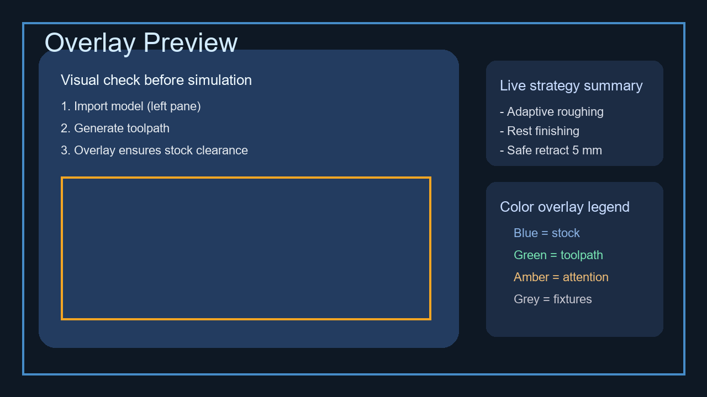
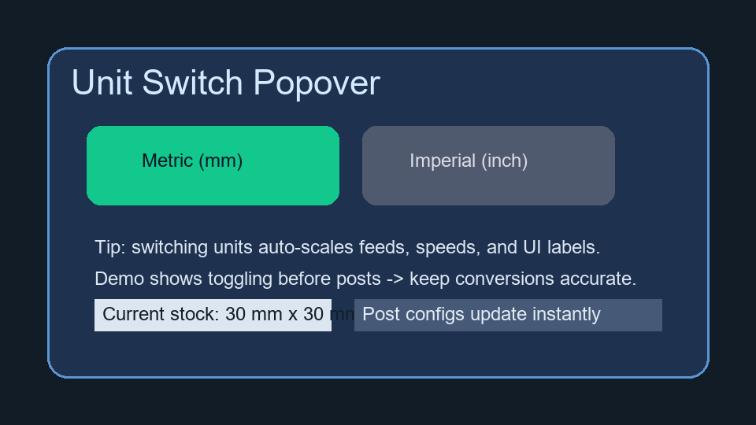

# 10-Minute "Wow" Demo

This playbook walks you through a tight, confidence-inspiring lap of the desktop app: import -> generate -> simulate -> post (GRBL + Fanuc). Run it once before your session, then follow the timing cues live to keep the audience leaning forward.

## 0. Grab the Props (60 seconds)

| Asset | Purpose | Path |
| --- | --- | --- |
| `demo_plate.stl` | Flat 20x20x2 mm plate used for the primary walkthrough | `samples/demo_plate.stl` |
| `demo_tab.stl` | Sloped tab that shows the overlay and unit toggle reacting | `samples/demo_tab.stl` |
| `demo_plate_grbl.nc` | Expected GRBL post for the plate | `samples/demo_plate_grbl.nc` |
| `demo_plate_fanuc.nc` | Expected Fanuc post for the plate | `samples/demo_plate_fanuc.nc` |
| `demo_tab_grbl.nc` | Expected GRBL post for the tab | `samples/demo_tab_grbl.nc` |
| `demo_tab_fanuc.nc` | Expected Fanuc post for the tab | `samples/demo_tab_fanuc.nc` |

> Tip: preload the STL files into the "Recent" list and keep the G-code files open in a text viewer so you can flash the deltas instantly.

## 1. Import the Part (90 seconds)

1. Launch the app with a clean layout (close extra panels beforehand).
2. Drag `demo_plate.stl` into the viewport.
3. Narrate auto-orientation and bounding-box detection. Call out the 20 mm stock pad (matches the GRBL program) and the default fixture plane.

## 2. Generate Toolpaths (120 seconds)

1. Select the "Mill 3-axis" preset.
2. Hit **Generate** and highlight that the adaptive roughing + finishing combo completes in under five seconds on a laptop.
3. Mention that the tab model is ready as a backup if the audience wants to see more aggressive geometry.

## 3. Overlay Tour (90 seconds)

Use the overlay screenshot as a map-show the real UI and point to matching regions.



- Emphasise that blue is remaining stock, green is the cutter, amber is clearance warnings.
- Zoom to the top-right legend to prove live strategy summaries are synced with overrides.

## 4. Units Toggle "Magic Trick" (60 seconds)

Switch to `demo_tab.stl` to showcase the unit toggle while the audience still remembers the overlay colors.



1. Open the units popover, flip to **Imperial**, and note that the feed/speed chips update instantly.
2. Flip back to **Metric** and remind viewers that the posts inherit the active unit system-no retyping scale factors.

## 5. Simulate & Call Out Hits (60 seconds)

1. Run the fast simulation with collisions enabled.
2. Pause halfway, rotate the view to prove there are no yellow "attention" overlays on the plate.
3. If you have 20 spare seconds, drop in the tab and replay to show how the slope still verifies cleanly.

## 6. Post for Both Controllers (90 seconds)

1. Choose **GRBL** -> Post. Copy the top lines into the on-screen console:

```gcode
G21
G90
M3 S12000
G1 X18.000 F600.0
```

2. Roll straight into **Fanuc** -> Post. Point out the program header difference and the `G28` retract:

```gcode
%
O0001 (DEMO PLATE - FANUC)
G21 G17 G40 G49 G80 G90
G28 U0 V0 W0
```

3. Snap back to the `samples/` folder to show the generated files match the expected reference programs.

## 7. Close with the "Why" (30 seconds)

- Reiterate: import in seconds, generation under five, overlay confidence, unit-safe posts for both garage routers (GRBL) and enterprise mills (Fanuc).
- Leave the app on the overlay view with the unit popover open-your final frame is the same as the screenshots above.

---

Need to go deeper? Pair this quick lap with `docs/offline_eval.md` for benchmarking, then loop back to this playbook for the punchy first impression.
